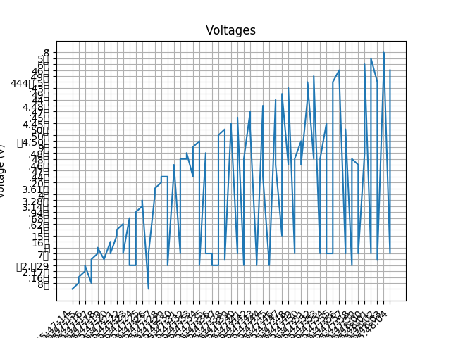

# Arduino and Raspberry Pi Demo


## Getting started with Raspberry Pi.

Your Raspberry Pi will come booted up with Raspbian OS.

For the first time, you need to connect a moniter and keyboard as I/O devices to get the IP address of the Raspberry Pi.

### Get the IP address of raspberry Pi

* Click on the **terminal** icon on task bar. A terminal window opens up.

* Type: `ifconfig`

* The output will give you the ip address of the Raspberry Pi.

* Make a note of the IP address. 

## VNC

VNC (Virtual Network Computing) is a graphical desktop sharing system that you can use to remotely control Raspberry Pi.

Download [VNC Viewer](https://www.realvnc.com/en/connect/download/viewer/).

Open VNC Viewer on your computer and enter Raspberry Pi's IP address.

Enter the Raspberry Pi user name and password.

Default username: Pi
Default password: raspberry

**NOTE**: Change the default password.


## Basic linux terminal operation

List directory: `ls`

Change directory: `cd directory_name`

Make directory: `mkdir directory_name`

Go one level above in the directory structure: `cd ..`

Delete file: `rm file_name`

**NOTE:** Directory means folder.


## Running Arduino code

Check if the Arduino is detected.

The port must be detected.

Select the correct Arduino.

```
void setup()
{
    serial.begin(9600);
}

void loop()
{
    int sensorValue = analogRead(A5);
    float voltage = sensorValue * (5.0 / 1023.0);
    Serial.println(voltage);
    delay(5);
}

```

## Nano editor

To access Nano editor on Raspberry Pi type the following in the terminal:

`nano filename.extension`

Example: To create a file called `helloworld.py` type `nano helloworld.py`.

## Python demo

Install virtual environment: 
`pip install virtualenv`

Create virtual environment: 
`python -m venv venv`

Activate virtual environment: 
`source venv/bin/activate`

**Installing dependencies**:

`pip install -r requirements.txt`

### View ports

`python -m serial.tools.list_ports`


## Python Files

### demo test 0

Execute `demo_test0.py` by typing the following in the terminal:

`python demo_test0.py`

### demo test 1

Execute `demo_test1.py` by typing the following in the terminal:

`python demo_test1.py`

### demo test

Execute `demo_test.py` by typing the following in the terminal:

`python demo_test.py <number_of_iteration>`

**Example**: `python demo_test.py 100` runs the code for 100 iteration.

The code plots the graph using Matplotlib.




### demo csv

Execute `demo_csv.py` by typing the following in the terminal:

`python demo_csv.py`

The code exits by typing `ctrl + X` in the terminal.

The code will write the data in a file named `test.csv`.
